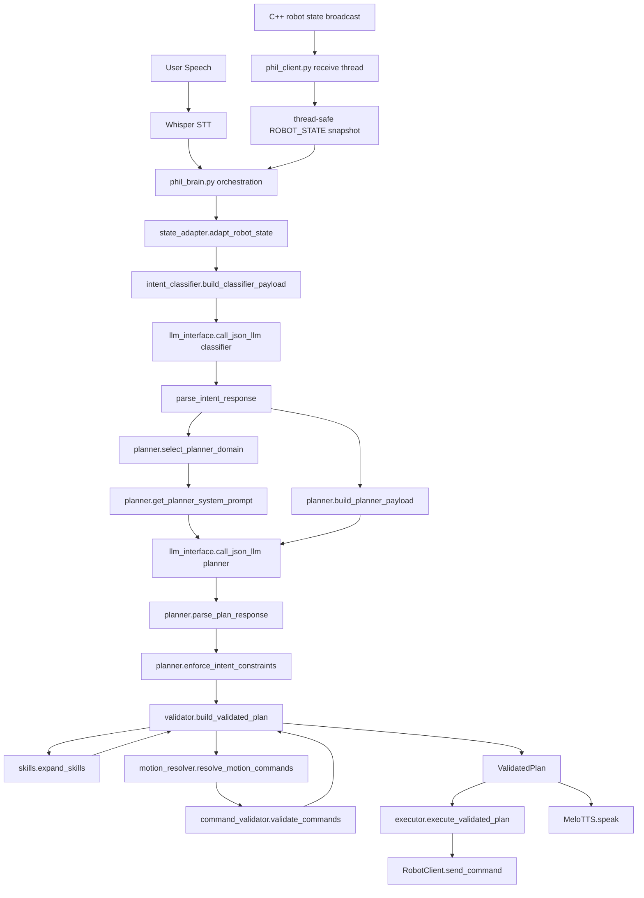

# Phil Robot LLM Pipeline Architecture

## Overview
This document summarizes the current Python-side LLM control architecture for `phil_robot`, the capabilities added during the refactor, and the runtime data flow between STT, LLM stages, planning, validation, execution, and feedback.

The system is no longer a monolithic:

```text
STT -> one LLM call -> parse -> send_command -> TTS
```

It has been refactored into a staged control pipeline with explicit contracts, domain routing, and plan validation.

Current top-level stages:

1. `STT`
2. `Runtime State Adaptation`
3. `Intent Classification`
4. `Domain-Specific Planning`
5. `Skill Expansion`
6. `Relative Motion Resolution`
7. `Command Validation`
8. `Plan Validation`
9. `Execution`
10. `TTS`
11. `State Feedback`

## What Changed Compared to the Original Loop

### Original Architecture
```text
Whisper STT
  -> one general-purpose LLM
  -> regex / string parser
  -> send_command(...)
  -> TTS
```

### Current Architecture
```text
Whisper STT
  -> state_adapter
  -> classifier LLM
  -> planner-domain router
  -> domain-specific planner LLM
  -> planner JSON parse
  -> skill expansion
  -> relative motion resolver
  -> command validator
  -> ValidatedPlan
  -> executor
  -> TTS
  -> robot state feedback
```

### Major Engineering Improvements
- JSON-only LLM outputs instead of free-form control strings
- explicit classifier/planner split
- domain-specific planner routing
- high-level skill abstraction
- plan-level validation object (`ValidatedPlan`)
- low-level runtime state separated from LLM state summaries
- runtime safety no longer delegated purely to prompts
- reduced parser fragility
- clearer debugging and future replay/evaluation insertion points

## Current Capabilities

### Interaction Capabilities
- Korean speech input via Whisper STT
- Korean spoken response via MeloTTS
- two-stage LLM inference
  - stage 1: intent classifier
  - stage 2: planner
- domain-specific planning
  - `chat`
  - `motion`
  - `play`
  - `status`
  - `stop`
  - `generic`
- safety-aware rejection messaging
- state-aware explanatory responses

### Control Capabilities
- direct low-level command support:
  - `r`
  - `h`
  - `s`
  - `p:<song_code>`
  - `look:pan,tilt`
  - `gesture:<name>`
  - `led:<emotion>`
  - `move:<motor>,<angle>`
  - `wait:<seconds>`
- relative motion interpretation:
  - `올려봐`
  - `내려봐`
  - `50도 더 올려`
  - `거기서 50도 더 올리고 2초 있다`
- joint range blocking
- robot-state-based blocking
  - lock key
  - play state
  - error state
  - busy / non-fixed state
- sequential-command warning generation

### Skill-First Planning Capabilities
Planner output can now contain high-level skills instead of only low-level commands.

Current built-in skills:
- `wave_hi`
- `nod_yes`
- `shake_no`
- `happy_react`
- `celebrate`
- `look_forward`
- `look_left`
- `look_right`
- `look_up`
- `look_down`
- `ready_pose`
- `idle_home`
- `play_tim`
- `play_ty_short`
- `play_bi`
- `play_test_one`
- `shutdown_system`

Each skill includes:
- `category`
- `description`
- deterministic low-level `commands`

This makes planner output more reproducible and easier to validate.

## Python LLM Architecture Diagram

### ASCII Diagram
```text
┌──────────────────────────────┐
│          User Speech         │
└──────────────┬───────────────┘
               │
               v
┌──────────────────────────────┐
│         Whisper STT          │
└──────────────┬───────────────┘
               │ user_text
               v
┌──────────────────────────────┐
│        phil_brain.py         │
│      orchestration layer     │
└──────────────┬───────────────┘
               │ raw_robot_state snapshot
               v
┌──────────────────────────────┐
│       state_adapter.py       │
│  adapt_robot_state()         │
│  build_*_state_summary()     │
└───────┬──────────────┬───────┘
        │              │
        │ full state   │ high-level summaries
        │              │
        │              v
        │    ┌──────────────────────────────┐
        │    │   intent_classifier.py       │
        │    │ classifier payload builder   │
        │    └──────────────┬───────────────┘
        │                   │
        │                   v
        │    ┌──────────────────────────────┐
        │    │      llm_interface.py        │
        │    │ call_json_llm(classifier)    │
        │    └──────────────┬───────────────┘
        │                   │ classifier JSON
        │                   v
        │    ┌──────────────────────────────┐
        │    │ parse_intent_response()      │
        │    └──────────────┬───────────────┘
        │                   │
        │                   v
        │    ┌──────────────────────────────┐
        │    │  planner.py                  │
        │    │  select_planner_domain()     │
        │    │  get_planner_system_prompt() │
        │    │  build_planner_payload()     │
        │    └──────────────┬───────────────┘
        │                   │
        │                   v
        │    ┌──────────────────────────────┐
        │    │      llm_interface.py        │
        │    │ call_json_llm(planner)       │
        │    └──────────────┬───────────────┘
        │                   │ planner JSON
        │                   v
        │    ┌──────────────────────────────┐
        │    │ parse_plan_response()        │
        │    │ enforce_intent_constraints() │
        │    └──────────────┬───────────────┘
        │                   │ planner_result
        │                   v
        │    ┌──────────────────────────────┐
        │    │        validator.py          │
        │    │   build_validated_plan()     │
        │    └───────┬──────────────┬───────┘
        │            │              │
        │            │              │
        │            v              v
        │   ┌────────────────┐   ┌────────────────────────┐
        │   │   skills.py    │   │  motion_resolver.py    │
        │   │ expand_skills  │   │ relative motion -> abs │
        │   └────────────────┘   └────────────┬───────────┘
        │                                      │
        │                                      v
        │                          ┌────────────────────────┐
        │                          │ command_validator.py   │
        │                          │ syntax/range/state     │
        │                          └────────────┬───────────┘
        │                                       │
        │                                       v
        │                          ┌────────────────────────┐
        │                          │      ValidatedPlan      │
        │                          └────────────┬───────────┘
        │                                       │
        │                                       v
        │                          ┌────────────────────────┐
        │                          │      executor.py       │
        │                          │ execute_validated_plan │
        │                          └────────────┬───────────┘
        │                                       │
        │                                       v
        │                          ┌────────────────────────┐
        │                          │   RobotClient socket   │
        │                          └────────────┬───────────┘
        │                                       │
        │                                       v
        │                          ┌────────────────────────┐
        │                          │        MeloTTS         │
        │                          └────────────────────────┘
        │
        v
┌──────────────────────────────┐
│  phil_client.py feedback     │
│  thread-safe ROBOT_STATE     │
└──────────────────────────────┘
```

### Mermaid Diagram


## Module Responsibilities

### 1. Orchestration Layer
File: [phil_brain.py](/home/shy/robot_project/phil_robot/phil_brain.py)

Responsibilities:
- runtime bootstrap
- STT invocation
- state snapshot acquisition
- pipeline invocation
- validated plan execution
- TTS invocation
- human-readable debug logging

This file is now an orchestration entrypoint, not a mixed logic container.

### 2. State Adaptation Layer
File: [state_adapter.py](/home/shy/robot_project/phil_robot/state_adapter.py)

Responsibilities:
- normalize raw robot state from C++
- map internal song codes to display labels
- alias `error_message` -> `error_detail`
- preserve full runtime state for low-level Python control logic
- build LLM-facing high-level state summaries

State is intentionally split into two representations.

#### Full Adapted Runtime State
Used by:
- [motion_resolver.py](/home/shy/robot_project/phil_robot/motion_resolver.py)
- [command_validator.py](/home/shy/robot_project/phil_robot/command_validator.py)
- [validator.py](/home/shy/robot_project/phil_robot/validator.py)

Contains:
- `current_angles`
- `last_action`
- full execution context

#### LLM State Summaries
Used by:
- [intent_classifier.py](/home/shy/robot_project/phil_robot/intent_classifier.py)
- [planner.py](/home/shy/robot_project/phil_robot/planner.py)

Contains only high-level state:
- mode/state
- busy/can_move
- current song
- current song label
- progress
- last action
- error detail

This is a deliberate abstraction boundary. Low-level joint telemetry is no longer injected into every LLM prompt.

### 3. Intent Classification Layer
File: [intent_classifier.py](/home/shy/robot_project/phil_robot/intent_classifier.py)

Responsibilities:
- classify user intent
- estimate `needs_motion`
- estimate `needs_dialogue`
- provide a coarse `risk_level`
- apply post-parse normalization for motion-bearing intents

Output schema:

```json
{
  "intent": "chat | motion_request | play_request | status_question | stop_request | unknown",
  "needs_motion": true,
  "needs_dialogue": true,
  "risk_level": "low | medium | high"
}
```

### 4. LLM Interface Layer
File: [llm_interface.py](/home/shy/robot_project/phil_robot/llm_interface.py)

Responsibilities:
- wrap Ollama chat invocation
- enforce JSON output mode
- centralize LLM fallback handling

### 5. Domain-Specific Planning Layer
File: [planner.py](/home/shy/robot_project/phil_robot/planner.py)

Responsibilities:
- map `intent` to planner domain
- choose domain-specific system prompt
- build planner payload
- parse planner JSON
- enforce post-plan domain constraints

Current planner domains:
- `chat`
- `motion`
- `play`
- `status`
- `stop`
- `generic`

Planner output schema:

```json
{
  "skills": ["wave_hi"],
  "commands": [],
  "speech": "안녕하세요!",
  "reason": "simple greeting"
}
```

Planner domains reduce prompt interference between unrelated tasks. For example:
- chat planning no longer shares the same main prompt logic as play planning
- status explanation is separated from motion generation
- stop/shutdown planning is isolated from social/motion planning

### 6. Skill Registry Layer
File: [skills.py](/home/shy/robot_project/phil_robot/skills.py)

Responsibilities:
- maintain stable high-level behavior macros
- associate skills with categories and descriptions
- expand symbolic actions into deterministic command sequences
- deduplicate consecutive duplicate commands

Skill categories:
- `social`
- `visual`
- `posture`
- `play`
- `system`

### 7. Relative Motion Resolution Layer
File: [motion_resolver.py](/home/shy/robot_project/phil_robot/motion_resolver.py)

Responsibilities:
- resolve relative motion language into absolute motor targets
- infer omitted joint context from `last_action`
- block over-limit relative requests before execution
- strip associated `wait` chains when a preceding move is invalid

This is where low-level joint state becomes relevant again.

### 8. Command Validation Layer
File: [command_validator.py](/home/shy/robot_project/phil_robot/command_validator.py)

Responsibilities:
- grammar validation
- enum validation
- range validation
- state gating
- legacy normalization
- sequence warning generation

Validated concerns include:
- command syntax
- joint range compliance
- lock-key gating
- play-state gating
- busy-state gating
- coarse sequencing risks

### 9. Plan Validation Layer
File: [validator.py](/home/shy/robot_project/phil_robot/validator.py)

Responsibilities:
- expand skills
- resolve relative motions
- validate resulting low-level commands
- merge all warnings
- finalize the user-facing speech

Execution contract:

```python
ValidatedPlan(
    skills=[...],
    raw_commands=[...],
    expanded_commands=[...],
    resolved_commands=[...],
    valid_commands=[...],
    rejected_commands=[...],
    warnings=[...],
    speech="...",
    reason="..."
)
```

`ValidatedPlan` is the current boundary between planning and execution.

### 10. Execution Layer
Files:
- [executor.py](/home/shy/robot_project/phil_robot/executor.py)
- [command_executor.py](/home/shy/robot_project/phil_robot/command_executor.py)

Responsibilities:
- consume only validated plans
- transmit robot commands over the socket client
- handle `wait:<seconds>` in Python as a temporary executor-side delay primitive

### 11. Transport and Feedback Layer
Files:
- [phil_client.py](/home/shy/robot_project/phil_robot/phil_client.py)
- [DrumRobot.cpp](/home/shy/robot_project/DrumRobot2/src/DrumRobot.cpp)

Responsibilities:
- receive robot state asynchronously
- maintain a thread-safe state snapshot
- merge angle updates with deadband behavior
- suppress noisy angle spam in `state == 2`
- expose runtime feedback to the next interaction turn

On the C++ side:
- real `current_angles` are broadcast
- state broadcast uses deadband / hysteresis-like filtering

## End-to-End Runtime Flow

1. User speaks.
2. Whisper STT converts audio to text.
3. [phil_brain.py](/home/shy/robot_project/phil_robot/phil_brain.py) acquires a stable state snapshot from [phil_client.py](/home/shy/robot_project/phil_robot/phil_client.py).
4. [state_adapter.py](/home/shy/robot_project/phil_robot/state_adapter.py) normalizes raw runtime state.
5. [intent_classifier.py](/home/shy/robot_project/phil_robot/intent_classifier.py) builds a compact classifier payload.
6. [llm_interface.py](/home/shy/robot_project/phil_robot/llm_interface.py) calls the classifier model.
7. [planner.py](/home/shy/robot_project/phil_robot/planner.py) maps `intent` to a planner domain and builds the planner payload.
8. [llm_interface.py](/home/shy/robot_project/phil_robot/llm_interface.py) calls the planner model with the domain-specific prompt.
9. [planner.py](/home/shy/robot_project/phil_robot/planner.py) parses planner JSON and enforces domain constraints.
10. [validator.py](/home/shy/robot_project/phil_robot/validator.py) expands skills and resolves relative motions.
11. [command_validator.py](/home/shy/robot_project/phil_robot/command_validator.py) validates resulting low-level commands.
12. A `ValidatedPlan` is produced.
13. [executor.py](/home/shy/robot_project/phil_robot/executor.py) transmits only validated commands.
14. [phil_brain.py](/home/shy/robot_project/phil_robot/phil_brain.py) forwards final speech to TTS.
15. [phil_client.py](/home/shy/robot_project/phil_robot/phil_client.py) receives updated state from C++.
16. The next interaction turn consumes that feedback.

## Example Data Contracts

### Classifier Contract
```json
{
  "intent": "play_request",
  "needs_motion": true,
  "needs_dialogue": true,
  "risk_level": "medium"
}
```

### Planner Contract
```json
{
  "skills": ["play_tim"],
  "commands": [],
  "speech": "좋아요, This Is Me를 연주해드릴게요!",
  "reason": "play_request intent에 따라 연주 skill 사용"
}
```

### ValidatedPlan Contract
```python
ValidatedPlan(
    skills=["play_tim"],
    raw_commands=[],
    expanded_commands=["r", "p:TIM", "led:play"],
    resolved_commands=["r", "p:TIM", "led:play"],
    valid_commands=["r", "p:TIM", "led:play"],
    rejected_commands=[],
    warnings=[],
    speech="좋아요, This Is Me를 연주해드릴게요!",
    reason="play_request intent에 따라 연주 skill 사용",
)
```

## Current Limitations
- planner still supports raw low-level commands in addition to skills
- `wait` is still executed in Python rather than natively on the robot controller
- no replay/evaluation harness yet
- no persistent per-stage experiment logging yet
- no closed-loop command acknowledgement layer yet
- status explanations still depend on planner language quality more than structured feedback reasoning

## Why the System Is Better Now
- lower coupling between prompts and execution safety
- much smaller parsing surface area
- clearer ownership boundaries between LLM stages and control stages
- planner specialization via domain routing
- skill-first action generation for reproducibility
- low-level controller state kept out of general LLM prompts
- explicit insertion points for future metrics, replay, and eval tooling

## Next Recommended Step
The next step is an evaluation / replay pipeline.

Recommended evaluation scope:
- classifier intent accuracy
- planner skill selection accuracy
- validator rejection rate
- fallback rate
- blocked-motion messaging correctness
- final execution success vs expected command sequence

This is the natural next phase because the current architecture already has clean per-stage contracts:
- classifier result
- planner result
- validated plan
- execution result

That makes it straightforward to build datasets, regression tests, and stage-level metrics without refactoring the control path again.
