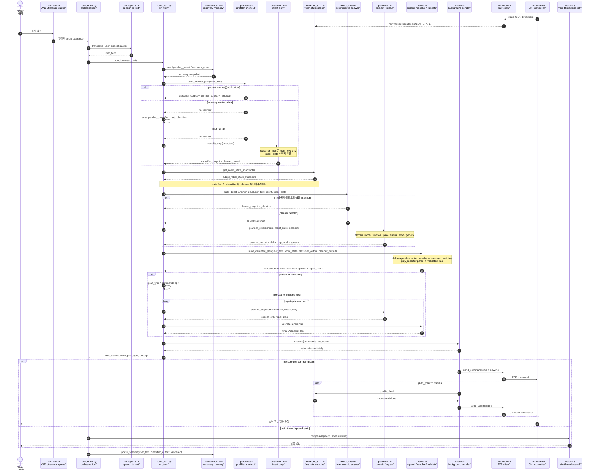

# Phil Robot Sequence Diagram

현재 구현 기준의 1턴 실행 흐름입니다.



핵심 변경점:

- `phil_brain.py`는 더 이상 Enter 기반 고정 녹음 루프가 아니라 `MicListener`가 만든 발화 단위 audio를 받아 STT를 실행합니다.
- 예전 그림의 `LLM Pipeline`은 현재 `robot_fsm.py`의 `preprocess -> classify -> state -> direct_answer -> planner -> validator -> execute` 단계로 풀려 있습니다.
- classifier는 현재 `robot_state`를 받지 않고 `user_text`만 받아 intent와 `needs_motion`을 분류합니다.
- cross-turn recovery가 진행 중이면 `SessionContext`의 `pending_classifier`를 재사용해 classifier를 건너뛰고 원래 planner domain을 이어갑니다.
- `robot_state`는 classifier 이후, planner 직전의 `state` step에서 fresh snapshot으로 가져옵니다.
- validator가 명령을 거부하거나 실행 정보가 부족하다고 판단하면 같은 턴 안에서 `repair` domain planner를 최대 2회 다시 호출합니다.
- executor는 명령을 백그라운드에서 TCP로 전송하고, TTS는 `phil_brain.py` 메인 스레드에서 재생합니다.

## 예시 데이터 흐름

기준 발화:

```text
user_text = "그대에게 빠르게 연주해줘."
```

### 1. STT 이후 입력

`MicListener.read_utterance()`가 확정한 audio를 `transcribe_user_speech()`가 텍스트로 바꾼 뒤, `phil_brain.py`는 `run_turn(user_text)`만 호출합니다.

```text
MicListener audio
-> Whisper STT
-> user_text
-> robot_fsm.run_turn(user_text)
```

### 2. preprocess

`build_prefilter_plan()`은 LLM 없이 처리 가능한 발화를 먼저 잡습니다.

- pause/resume: `"멈춰"`, `"계속"` 등
- 인사 shortcut: `"안녕"`과 `"반가워"`가 함께 있는 경우

예시 발화 `"그대에게 빠르게 연주해줘."`는 prefilter 대상이 아니므로 classifier로 넘어갑니다.

### 3. classifier 입력

현재 classifier 입력은 상태 요약 없이 `user_text`만 포함합니다.

```json
{
  "user_text": "그대에게 빠르게 연주해줘."
}
```

### 4. classifier 출력

classifier는 intent와 동작 필요 여부만 결정합니다.

```json
{
  "intent": "play_request",
  "needs_motion": true
}
```

여기서 planner domain은 `play`로 정해집니다.

```json
{
  "planner_domain": "play"
}
```

### 5. state step

classifier가 끝난 뒤, planner 직전에 현재 로봇 상태를 새로 가져옵니다.

```json
{
  "state": 0,
  "bpm": 100,
  "is_fixed": true,
  "current_song": "None",
  "last_action": "idle_home",
  "is_lock_key_removed": true,
  "current_angles": {
    "waist": 0.0,
    "R_arm1": 45.0,
    "L_arm1": 45.0,
    "R_arm2": 0.0,
    "R_arm3": 20.0,
    "L_arm2": 0.0,
    "L_arm3": 20.0,
    "R_wrist": 90.0,
    "L_wrist": 90.0
  }
}
```

이 위치가 중요합니다. classifier LLM 지연 동안 로봇 상태가 바뀔 수 있으므로, planner와 validator는 가능한 한 최신 상태를 보게 합니다.

### 6. direct_answer

`build_direct_answer_plan()`은 상태와 intent만으로 바로 답할 수 있는 요청을 planner 없이 처리합니다.

- 지원 곡 목록 질문
- 이름/정체 확인형 질문
- 손 인사 후 특정 곡 재생 복합 요청
- 특정 관절 각도 질문

예시 발화는 직접 답변 대상이 아니므로 planner LLM으로 넘어갑니다.

### 7. planner 입력

planner는 domain, 최신 state summary, `needs_motion`, `user_text`, 선택적으로 session 요약과 repair hint를 받습니다.

```json
{
  "planner_domain": "play",
  "robot_state": {
    "state": 0,
    "can_move": true,
    "is_fixed": true,
    "busy": false,
    "current_song": "None",
    "bpm": 100,
    "progress": "unknown",
    "last_action": "idle_home",
    "error_message": "None",
    "current_angles": {
      "waist": 0.0,
      "R_arm1": 45.0,
      "L_arm1": 45.0,
      "R_arm2": 0.0,
      "R_arm3": 20.0,
      "L_arm2": 0.0,
      "L_arm3": 20.0,
      "R_wrist": 90.0,
      "L_wrist": 90.0
    }
  },
  "needs_motion": true,
  "user_text": "그대에게 빠르게 연주해줘."
}
```

### 8. planner 출력

planner LLM의 raw schema는 `s`, `c`, `t`, `r`이고, parser 이후 런타임에서는 `skills`, `op_cmd`, `speech`, `reason`으로 정규화됩니다.

```json
{
  "skills": [
    "play_ty_short"
  ],
  "op_cmd": [],
  "speech": "그대에게를 빠르게 연주할게요.",
  "reason": "사용자가 그대에게 연주를 요청했고 play skill로 처리 가능함"
}
```

### 9. validator 처리

validator는 planner 결과를 그대로 실행하지 않고 아래 순서로 최종 `ValidatedPlan`을 만듭니다.

```text
skills expand
-> relative motion resolve
-> command validate
-> play_modifier parse
-> ValidatedPlan
```

`빠르게` 같은 표현은 `play_modifier`로 계산됩니다.

```json
{
  "tempo_scale": 1.1,
  "velocity_delta": 0,
  "source": "explicit",
  "apply_scope": "next_play"
}
```

validator 이후 예시는 다음과 같습니다.

```json
{
  "valid_op_cmds": [
    "r",
    "p:TY_short"
  ],
  "play_modifier": {
    "tempo_scale": 1.1,
    "velocity_delta": 0,
    "source": "explicit",
    "apply_scope": "next_play"
  },
  "speech": "연주 속도를 빠르게 하겠습니다."
}
```

### 10. repair 루프

명령이 모두 거부되거나 필수 정보가 부족하면 validator가 `repair_hint`를 만듭니다.

```json
{
  "failure_code": "missing_info",
  "reason": "요청한 동작에 필요한 정보가 부족합니다.",
  "rejected": []
}
```

이 경우 `robot_fsm.py`는 같은 턴 안에서 planner를 `repair` domain으로 다시 호출합니다. repair planner는 새 동작을 계획하지 않고, 사용자에게 설명하거나 되묻는 speech-only plan을 만듭니다.

### 11. executor 전송

executor가 실제로 보내는 전송 명령 예시는 다음과 같습니다.

```json
{
  "requested_transport_cmds": [
    "tempo_scale:1.10",
    "r",
    "p:TY_short"
  ]
}
```

motion plan이면 executor의 `on_done` 콜백이 Home Watcher를 띄우고, 로봇이 실제로 멈춘 뒤 `h`를 보냅니다. play plan은 홈 복귀 대상이 아닙니다.

위 과정을 간단하게 표현하면 다음과 같습니다.

```text
audio utterance
-> STT user_text
-> preprocess shortcut check
-> classifier_output(play_request, needs_motion=true)
-> fresh robot_state fetch
-> direct_answer shortcut check
-> planner_input(planner_domain=play, latest robot_state)
-> planner_output(skills=["play_ty_short"])
-> validated_plan(valid_op_cmds=["r","p:TY_short"], play_modifier=tempo_scale 1.10)
-> executor commands(["tempo_scale:1.10","r","p:TY_short"])
-> TTS speech(main thread)
```
