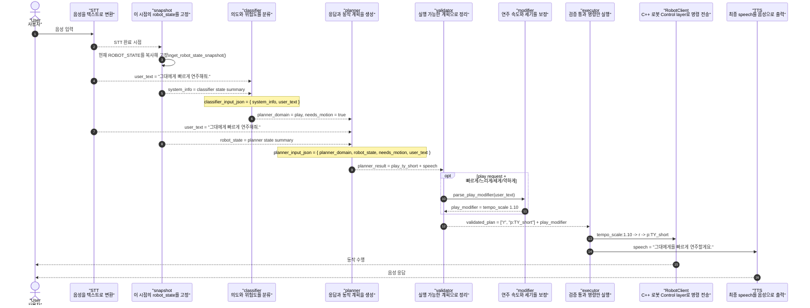

# Phil Robot Sequence Diagram



- snapshot은 STT 직후 현재 `ROBOT_STATE`를 복사해 발화가 종료될 때까지 동일한 상태를 유지합니다.
- classifier와 planner는 위에서 정해진 snapshot의 요약을 입력으로 받습니다.
- planner는 classifier 결과 전체를 다시 받지 않고 `needs_motion`만 사용합니다.
- `modifier`는 planner llm이 아닌 validator 단에서 빠르기와 세기 정보를 추출합니다.
- executor는 `play_modifier`가 있으면 `tempo_scale`, `velocity_delta`를 play command보다 먼저 전송합니다.

## 예시 데이터 흐름

기준 발화:

```text
user_text = "그대에게 빠르게 연주해줘."
```

### 1. snapshot 예시

- `get_robot_state_snapshot()` 예시입니다.

이 snapshot은 `transcribe_user_speech()`가 끝난 뒤, classifier llm을 호출하기 직전에 캡처됩니다.

```json
{
  "state": 0,
  "bpm": 100,
  "is_fixed": true,
  "current_song": "None",
  "last_action": "idle_home",
  "is_lock_key_removed": true,
  "current_angles": {
    "waist": 0.0,
    "R_arm1": 45.0,
    "L_arm1": 45.0,
    "R_arm2": 0.0,
    "R_arm3": 20.0,
    "L_arm2": 0.0,
    "L_arm3": 20.0,
    "R_wrist": 90.0,
    "L_wrist": 90.0
  }
}
```

### 2. classifier 입력

classifier는 state 전체를 그대로 받지 않고, `build_classifier_state_summary()`로 요약한 `system_info`와 `user_text`를 받습니다.
호출 순서는 `STT 완료 -> snapshot 캡처 -> classifier_input_json 생성`입니다.

```json
{
  "system_info": {
    "mode": 0,
    "can_move": true,
    "busy": false,
    "current_song": "None",
    "current_song_label": "None",
    "last_action": "idle_home",
    "error_detail": "None"
  },
  "user_text": "그대에게 빠르게 연주해줘."
}
```

### 3. classifier 출력 예시

classifier 출력 필드는 4개입니다.

```json
{
  "intent": "play_request",
  "needs_motion": true,
  "needs_dialogue": true,
  "risk_level": "medium"
}
```

여기서 planner domain은 이렇게 정해집니다.

```json
{
  "planner_domain": "play"
}
```

### 4. planner 입력

planner는 입력으로 ROBOT_STATE와 도메인, 모션 필요 유무, `user_text`를 받습니다.
즉 호출 순서는 `classifier 출력 -> planner_domain 선택 -> planner_input_json 생성 -> planner 호출`입니다.
출력 스키마 예시는 user JSON에 넣지 않고 system prompt에 포함되어 있습니다.
아래 구조로 `build_planner_input_json()`이 만들어집니다.

```json
{
  "planner_domain": "play",
  "robot_state": {
    "state": 0,
    "can_move": true,
    "is_fixed": true,
    "busy": false,
    "current_song": "None",
    "current_song_label": "None",
    "bpm": 100,
    "progress": "unknown",
    "last_action": "idle_home",
    "error_detail": "None",
    "current_angles": {
      "waist": 0.0,
      "R_arm1": 45.0,
      "L_arm1": 45.0,
      "R_arm2": 0.0,
      "R_arm3": 20.0,
      "L_arm2": 0.0,
      "L_arm3": 20.0,
      "R_wrist": 90.0,
      "L_wrist": 90.0,
      "R_foot": null,
      "L_foot": null
    }
  },
  "needs_motion": true,
  "user_text": "그대에게 빠르게 연주해줘."
}
```

### 5. planner 출력 예시

LLM 응답이라 문장은 달라질 수 있지만, 현재 skill 라이브러리 기준으로는 이런 형태로 나옵니다.
```json
{
  "skills": [
    "play_ty_short"
  ],
  "op_cmd": [],
  "speech": "그대에게를 빠르게 연주할게요.",
  "reason": "사용자가 그대에게 연주를 요청했고 play skill로 처리 가능함"
}
```

### 6. modifier 적용

modifier는 현재 rule-based 후처리로 동작하며, `빠르게`, `느리게`, `세게`, `약하게` 같은 키워드를 추출해 tempo/velocity 보정값으로 변환합니다. 추후에는 planner가 modifier까지 직접 출력하도록 바꿀 수도 있습니다.

```json
{
  "tempo_scale": 1.1,
  "velocity_delta": 0,
  "source": "explicit",
  "apply_scope": "next_play"
}
```

중요한 점:

- `modifier`는 planner가 만든 `speech`를 고치는 레이어가 아닙니다.
- `modifier`는 validator에서 계산되어 `ValidatedPlan.play_modifier`에 저장되고, `executor`가 이를 `tempo_scale/velocity_delta` 전송 명령으로 변환해 `valid_op_cmds` 앞에 붙입니다.

### 7. validator 이후 예시

`play_ty_short` skill은 실제 op command로 펼치면 `["r", "p:TY_short"]`가 됩니다. source는 `explicit`, `context`, `memory`, `inferred`로 구성되어 있으며 현재는 `explicit`만 사용 중입니다. 나머지는 순서대로 문맥, 사용자 선호, 표현상의 뉘앙스로 판단하는 데 활용할 예정입니다.

```json
{
  "valid_op_cmds": [
    "r",
    "p:TY_short"
  ],
  "play_modifier": {
    "tempo_scale": 1.1,
    "velocity_delta": 0,
    "source": "explicit",
    "apply_scope": "next_play"
  },
  "speech": "그대에게를 빠르게 연주할게요."
}
```

### 8. executor가 실제로 보내는 전송 명령 예시

executor에서 modifier를 play command보다 먼저 붙입니다.

```json
{
  "requested_transport_cmds": [
    "tempo_scale:1.10",
    "r",
    "p:TY_short"
  ]
}
```

위 과정을 간단하게 표현하면 다음과 같습니다.

```text
user_text
-> classifier_input_json
-> intent_result(play_request, needs_motion=true, needs_dialogue=true, risk_level=medium)
-> planner_input_json(planner_domain=play, needs_motion=true)
-> planner_result(skills=["play_ty_short"])
-> play_modifier(tempo_scale=1.10)
-> validated_plan(valid_op_cmds=["r","p:TY_short"])
-> requested_transport_cmds(["tempo_scale:1.10","r","p:TY_short"])
```
