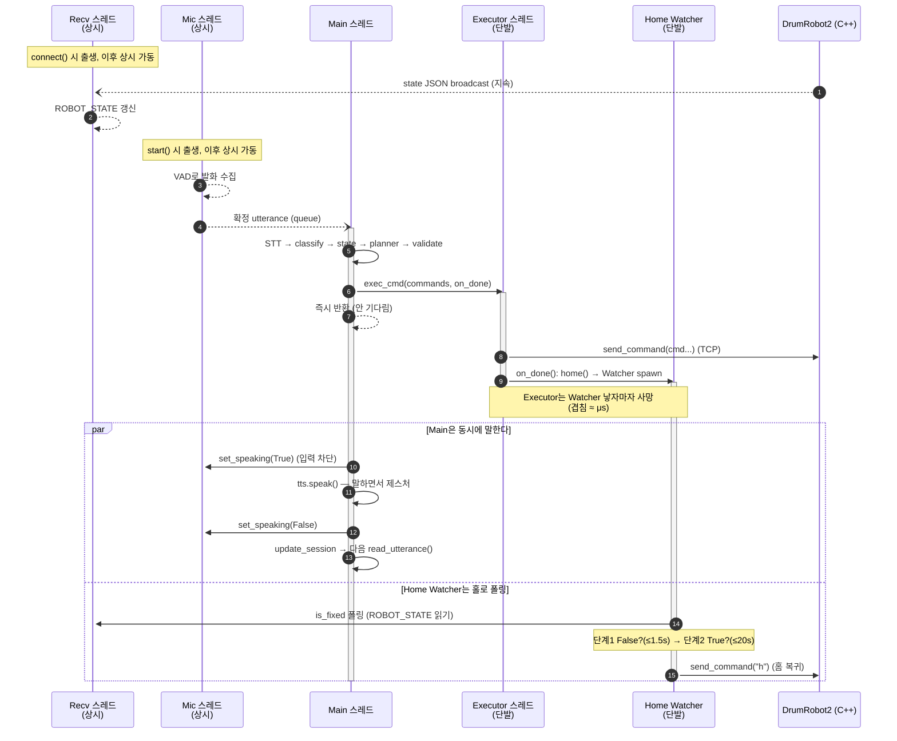

# Phil Robot 스레드 생명주기 (Thread Lifecycle)

> 이 문서는 `phil_robot` 런타임이 도는 동안 **어떤 스레드가 언제 태어나고, 무슨 일을
> 하고, 언제 죽고, 어디서 서로 겹치는지**를 정리한다. 일반적인 시퀀스 다이어그램이
> "메시지 순서"를 보여준다면, 이 문서는 "**스레드의 수명선(lifeline)**"을 보여준다.
>
> 단일 턴의 메시지 흐름은 [PHIL_SEQUENCE_DIAGRAM_KR.md](./PHIL_SEQUENCE_DIAGRAM_KR.md),
> 파이프라인 계층 설명은 [LLM_PIPELINE_ARCHITECTURE_KR.md](./LLM_PIPELINE_ARCHITECTURE_KR.md)를 참고한다.

---

## 1. 등장하는 스레드 (총 5종)

| 스레드 | 생성 위치 | 수명 | 데몬 | 역할 |
|---|---|---|---|---|
| **Main** | 프로세스 진입 (`main()`) | 프로세스 전체 | — | `while` 루프: STT → `run_turn` → TTS |
| **Recv** (`_receive_loop`) | `RobotClient.connect()` | 연결~`close()` (상시) | ✓ | C++ state JSON 수신 → 전역 `ROBOT_STATE` 갱신 |
| **Mic** (`_listen_loop`) | `MicListener.start()` | start~`close()` (상시) | ✓ | VAD로 발화 수집 → utterance 큐에 push |
| **Executor** (`_run_commands`) | `executor.exec_cmd()` | **명령 묶음 1회당** 생성·소멸 | ✓ | 명령을 순서대로 TCP 전송 후 `on_done()` |
| **Home Watcher** (`_watch`) | `home()` | **motion 턴 1회당** 생성·소멸 | ✓ | `is_fixed` 폴링 후 홈 복귀 `h` 전송 |

핵심 구분:

- **상시 스레드 2개** — `Recv`, `Mic`. 시작 시 한 번 떠서 종료까지 산다. 턴마다 새로 안 생긴다.
- **단발 스레드 2개** — `Executor`, `Home Watcher`. 명령이 있을 때만 떴다가 일을 마치면 죽는다.
- **Main 1개** — 모든 걸 조립하고 턴 루프를 돈다. STT와 TTS는 Main 위에서 **동기적**으로 실행된다.

관련 코드:
[phil_brain.py](../phil_brain.py),
[runtime/phil_client.py](../runtime/phil_client.py),
[runtime/mic_listener.py](../runtime/mic_listener.py),
[pipeline/exec_thread.py](../pipeline/exec_thread.py),
[pipeline/robot_fsm.py](../pipeline/robot_fsm.py)

---

## 2. 기동(startup) 시 스레드 출생 순서

```
프로세스 시작
   │
   ▼
Main: load_runtime()
   │   ├─ RobotClient.connect()  ──────────────►  ★ Recv 스레드 출생 (이후 상시)
   │   ├─ TTS_Engine() 로드
   │   └─ whisper.load_model() + warm-up
   │
   ▼
Main: tts.speak("대화 준비가 되었습니다")   (Main 위에서 직접)
   │
   ▼
Main: SessionContext() / Executor() 객체 생성   (※ 아직 스레드 아님)
   │
   ▼
Main: build_run_turn(...)   (클로저 조립)
   │
   ▼
Main: MicListener().start()  ───────────────────►  ★ Mic 스레드 출생 (이후 상시)
   │
   ▼
Main: while True  ← 여기서부터 턴 루프
```

`Executor` **객체**는 startup에 만들어지지만, 실제 **Executor 스레드**는 명령이 있는
턴에서 `exec_cmd()`가 불릴 때마다 새로 태어난다(객체 ≠ 스레드).

---

## 3. motion 턴 1회 — 스레드 수명선 타임라인

가장 스레드가 많이 겹치는 **motion 턴**(예: "안녕 반가워" → 손 흔들기)을 기준으로,
시간축을 왼쪽→오른쪽으로 두고 각 스레드의 삶을 lane으로 그린 그림이다.
`════`는 그 스레드가 **살아서 일하는 중**, `····`는 **살아있지만 대기/유휴**,
`▶`는 출생, `✝`는 사망을 뜻한다.

```
 시간 ──────────────────────────────────────────────────────────────────────────►

 Recv     ════════════════════════════════════════════════════════════════════  (상시: ROBOT_STATE 계속 갱신)

 Mic      ══[발화 수집]══▶큐에 push ····(유휴)····│███ TTS동안 입력 버림 ███│····  (상시)
                              │
                              ▼ read_utterance() 가 꺼냄
 Main     ····(대기)····│[STT]│[classify LLM]│[state]│[planner LLM]│[validate]│
                                                                              │
                                                          execute → exec_cmd()│던짐
                                                                              ├──────────────┐
                                                                              │              ▼
 Executor                                                                     ▶ ════════════ │  cmd 순차 전송
                                                                              │  send(cmd1..) │
                                                                              │  on_done():   │
                                                                              │   home()호출 ─┼──┐
                                                                              │  ✝ (곧 사망)  │  │
                                                                              │              │  ▼
 Home                                                                         │              ▶ ════════════════════
 Watcher                                                                      │              단계1 is_fixed=False?(≤1.5s)
                                                                              │              단계2 is_fixed=True?(≤20s)
                                                                              │              단계3 send("h") → ✝
                                                                              ▼
 Main(계속) ──────────────────────────────► set_speaking(True)│[TTS speak 말하기]│set_speaking(False)
                                                              │                 │
                                                              └─ 이 구간 Mic 입력 버려짐 ┘
                                                                                │
                                                              update_session → 다음 read_utterance() 로 복귀
```

읽는 법:

1. **Recv / Mic는 내내 살아있다.** 턴이 시작돼도 죽지 않는다 — 배경에서 계속 돈다.
2. **Mic가 발화를 확정해 큐에 넣는 순간** Main의 `read_utterance()`가 그걸 꺼내며 턴이 시작된다. (Mic→Main 핸드오프)
3. Main은 **STT → classify → state → planner → validate를 전부 자기 위에서 동기로** 처리한다. 이 구간엔 Executor/Watcher가 아직 없다.
4. `execute`가 **Executor 스레드를 던지고 즉시 반환**한다. Main은 안 기다리고 바로 TTS로 넘어간다 → **Executor와 Main(TTS)이 겹친다** = "말하면서 손 흔들기".
5. Executor는 명령을 다 보내고 `on_done`에서 **Home Watcher를 낳자마자 죽는다.** → Executor와 Home Watcher의 **생명주기 겹침은 함수 반환 찰나(≈μs)뿐**.
6. **Home Watcher는 홀로 오래 산다(최대 ~21.5초).** 이때 Main은 이미 TTS도 끝내고 **다음 발화 대기로 돌아가 있을 수 있다** → Watcher와 Main이 겹친다(사람은 로봇이 멈추길 기다리는 동안에도 다시 말 걸 수 있음).
7. Home Watcher는 `h`를 보내고 죽는다.

---

## 4. 같은 흐름의 Mermaid 시퀀스 (activation = 수명)

GitHub에서 렌더되는 버전. `activate/deactivate` 막대가 곧 그 스레드가 **살아 일하는 구간**이다.
상시 스레드(Recv/Mic)는 박스가 처음부터 끝까지 켜져 있고, 단발 스레드(Executor/Home Watcher)는
중간에 켜졌다 꺼진다.



---

## 5. 스레드별 상세 수명

### Main 스레드
- **출생/사망**: 프로세스와 동일.
- **하는 일**: `load_runtime` → 인사 TTS → 턴 루프. 한 턴 안에서 **STT·classifier LLM·planner LLM·validator·TTS를 전부 직접(동기) 실행**한다.
- **안 하는 일**: 로봇 명령 전송을 기다리지 않는다(Executor에 위임). 홈 복귀를 기다리지 않는다(Home Watcher에 위임).
- 종료: `KeyboardInterrupt` → `finally`에서 `listener.close()`(Mic 정리) 후 `bot.close()`.

### Recv 스레드 ([phil_client.py](../runtime/phil_client.py))
- **출생**: `RobotClient.connect()` 성공 직후 `recv()`가 데몬으로 띄움.
- **하는 일**: 소켓에서 `\n` 단위 JSON을 받아 `STATE_LOCK` 아래 전역 `ROBOT_STATE`를 갱신. 각도 노이즈는 deadband로 병합.
- **누가 의존하나**: `state` step의 fresh fetch, 그리고 **Home Watcher의 `is_fixed` 폴링**이 전부 이 스레드가 갱신한 `ROBOT_STATE`를 읽는다. Recv가 멈추면 Watcher는 stale 상태를 보고 단계 2에서 20초를 꽉 채운다.
- **사망**: 소켓 close 또는 수신 에러.

### Mic 스레드 ([mic_listener.py](../runtime/mic_listener.py))
- **출생**: `MicListener.start()` (턴 루프 직전, 1회).
- **하는 일**: 0.1초 프레임 단위로 볼륨을 보고 `START_THRESHOLD` 넘으면 녹음 시작, 침묵이 `MAX_SILENT_FRAMES`(1.2초) 이어지면 발화 확정 → 큐에 push.
- **TTS 게이트**: `set_speaking(True)`면 입력을 버린다(self-echo 차단). 이때도 **스레드는 살아있다**, 단지 큐에 안 넣을 뿐.
- **사망**: `close()`가 `_running`을 내리고 join.

### Executor 스레드 ([exec_thread.py](../pipeline/exec_thread.py))
- **출생**: 명령이 있는 턴에서 `execute` step → `executor.exec_cmd()`가 매번 새 데몬 생성.
- **하는 일**: `commands`를 순서대로 `bot.send_command(cmd+"\n")`. 전송은 거의 즉시. 다 보내면 `on_done()` 호출.
- **wait/cancel 없음**: 예전엔 `wait:` 지연을 끊으려 `stop_event`/`cancel`이 있었으나, wait 자체가 제거되며 함께 사라졌다. 지금은 "보내고 on_done"만 한다.
- **사망**: `on_done()` 반환 직후 `_run_commands` 종료. motion이면 `on_done` 안에서 Home Watcher를 먼저 낳고 죽는다.

### Home Watcher 스레드 ([robot_fsm.py](../pipeline/robot_fsm.py) `home()` 내부 `_watch`)
- **출생**: `plan_type == "motion"`인 턴에서만. Executor의 `on_done`이 `home()` 호출 → 데몬 생성.
- **3단계 수명**:
  1. **움직임 시작 대기** — `is_fixed == False`를 최대 1.5초 폴링(50ms 간격). 못 보면 "움직임 미감지"로 보고 **홈 복귀를 건너뛰고 사망**.
  2. **정지 대기** — `is_fixed == True`(첫 회)를 최대 20초 폴링.
  3. **홈 복귀** — `bot.send_command("h\n")` 전송.
- **사망**: 단계 1 미감지 종료, 또는 단계 3 전송 후 종료.
- 자세한 단계별 의미와 `not get(..., True)` 기본값 처리는 [robot_fsm.py:390-423](../pipeline/robot_fsm.py#L390-L423) 참고.

---

## 6. 턴 종류별 어떤 스레드가 뜨는가

| 턴 종류 | Executor | Home Watcher | 비고 |
|---|---|---|---|
| **motion** (gesture/posture/move) | ✓ | ✓ | 동작 후 `h`로 홈 복귀 |
| **play** (`r`, `p:*`) | ✓ | ✗ | 연주는 홈 복귀 안 함 |
| **stop** (`pause`) | ✓ | ✗ | 정지/재개는 홈 복귀 안 함 |
| **look-only** (`look:*`) | ✓ | ✗ | 시선만 바꾼 건 홈 복귀 제외 |
| **chat / status / 직답** | ✗ (commands 비면 스킵) | ✗ | Main이 TTS만 함 |

`commands`가 비어 있으면 `execute` step이 `exec_cmd`를 아예 호출하지 않으므로
**Executor 스레드도 안 생긴다**(chat·직답 턴).

---

## 7. 겹침(race)과 주의점

- **Executor ↔ Home Watcher**: 거의 안 겹친다. Watcher는 Executor가 죽기 직전 마지막 행위로 태어난다.
- **Executor/Watcher ↔ Main(TTS)**: 의도적으로 겹친다. 로봇이 움직이는 동안 Main은 말하고, 그 후 다음 발화 대기로 돌아간다.
- **빠른 동작 누락**: 동작이 1.5초보다 빨리 끝나면 Watcher가 단계 1에서 `is_fixed=False`를 한 번도 못 보고 홈 복귀를 건너뛸 수 있다(현재 알려진 한계). 폴링→이벤트 기반이나 C++ 동작 완료 토큰 도입이 근본 해결책.
- **Watcher의 암묵적 Recv 의존**: Watcher는 소켓을 직접 안 읽고 Recv가 갱신한 `ROBOT_STATE`만 본다. 두 단발 스레드가 상시 Recv에 의존한다는 점을 그림에서 놓치기 쉽다.
- **데몬 특성**: Executor/Home Watcher/Recv/Mic 모두 데몬이라, Main이 죽으면 같이 사라진다. 단 Mic만 `close()`에서 명시적으로 join한다.
